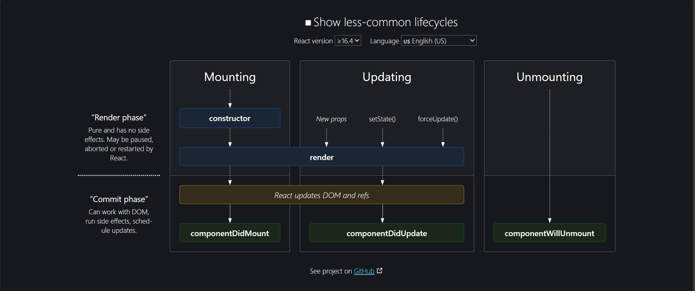
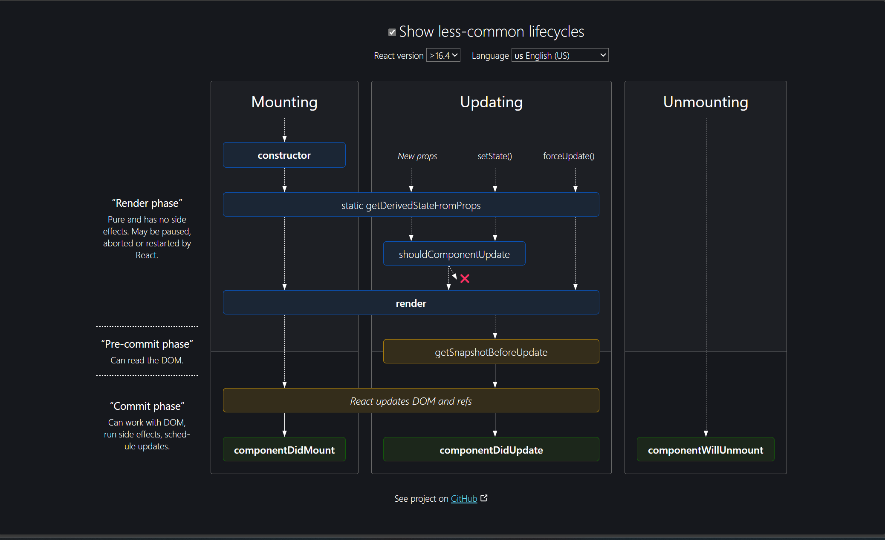

# Class based Vs Functional based Components

### Question 1 : Explain Class based Components in React.

    - Way to create components using ES6 classes.

    - Older way of writing components compared to functional components.

    - Can contain state and have access to lifecycle methods, which get executed at various
    points in a component's life cycle.

### Example : 

```javascript
class Counter extends React.Component {
    constructor(props){
        super(props)
        this.state = { // State creation
            count:0,
        };
    }

    Increment = () => {
        this.setState({ count: this.state.count + 1 });
    }

    render(){
        return(
            <div>
                <p>Count : {this.state.count}</p>
                <button onClick={this.Increment}>Add</button>
            </div>
        );
    }
}
```

### Question 2: Explain constructor and super keywords used in the above example.

### Constructor : 

    - Initializing State: It is used to initialize the component's state by assigning an initial value to "this.state".

    - Binding Event Handlers or Methods: It is also used to bind event handlers or methods to component instance. 

### Super : 

    - Used inside the constructor to call the constructor of the parent class.

    - Ensures that the component's props are correctly initialized and available within the component. 

### Question 3 : Explain Component Lifecycle Methods by adding them to this counter app.


<br />
<br />


### Example : 

```javascript
class Counter extends React.Component {
    constructor(props){
        super(props)
        this.state = { // State creation
            count:0,
            count1:0
        };
    }

    Increment = () => {
        this.setState({ count: this.state.count + 1 });
    }

    Increment1 = () => {
        this.setState({ count1: this.state.count1 + 1 });
    }

    // Mounting
    componentDidMount(){
        console.log("Component Mounted")
    }

    // Updating
    componentDidUpdate(prevProps, prevState){
        if (prevState.count != this.state.count) {
            console.log(prevState.count)
            console.log(this.state.count)
            console.log("Component Updated");
        }
    }
    // Used to detect changes in state and props. This is similar like useEffect.

    // Unmounting
    componentWillUnmount(){
        console.log("Component Unmounted")
    }

    render(){
        return(
            <div>
                <p>Count : {this.state.count}</p>
                <button onClick={this.Increment}>Add</button>
                <p>Count : {this.state.count1}</p>
                <button onClick={this.Increment1}>Add Count1</button>
            </div>
        );
    }
}
```

###  Question 4: Explain Function Based Component and what are hooks?

```javascript
const PhotoGallery = () => {
    return (
        <div>
            <h1>Photo Gallery</h1>
        </div>
    );
}
```

    Hooks are functions that allow functional components to use state, lifecycle methods, and other React features previously available only in class components.

### Explain any 2 hooks.

#### useState :
    The useState hook is a powerful addition to React, introduced in version 16.8. It allows you to manage state within functional components without the need for class-based components.

#### useEffect :
    useEffect hook is mainly used to manage side effects in functional components. Some examples of side effects are: fetching data, directly updating the DOM, and timers.

```javascript
// useState and useEffect
const PhotoGallery = () => {
    const [photos, setPhotos] = React.useState([]); //useState Hook

    React.useEffect(() => {
        fetch("https://jsonplaceholder.typicode.com/photos")
        .then((res) => res.json())
        .then((data) => setPhotos(data))
        .catch((err) => console.error(err));
    }, [])
    
    return (
        <div>
            <h1>Photo Gallery</h1>
            <div>
                {photos.slice(0, 25).map((photo) => {
                    return 
                })}
            </div>
        </div>
    );
}
```

### Question 5: Convert this Class based component to Function Based Component and explain it.

Note : Refer ClassToFunc.js file.